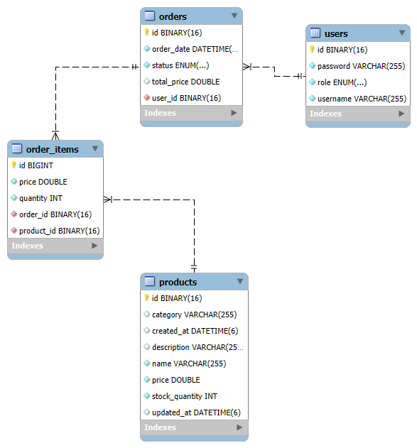
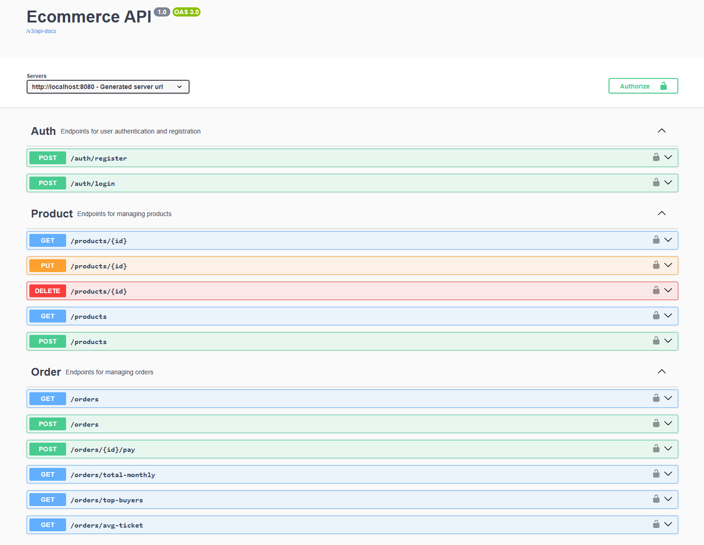

# ECOMMERCE-API


## Descrição
API Rest responsável pelo gerenciamento de um sistema e-commerce.



## Tecnologias Utilizadas
- Java 21
- Spring Boot
- MySQL
- Spring Security
- Spring Data JPA
- Hibernate

## Rotas




## Rodando a aplicação localmente

1. Clone o repositório:

```bash
git clone https://github.com/seu-usuario/ecommerce-api.git
cd ecommerce-api
```

2. Configure as variáveis de ambientes de acordo com o que está em [.env.sample](.env.sample)

3. Crie um usuário ADMIN manualmente no banco de dados ou utilize o dump no MySQL: [backup.sql](backup.sql) 

4. Compile e execute com o Maven:

```bash
mvnw spring-boot:run
```

5. Faça uma chamada HTTP para os endpoints ou acesse a aplicação via Swagger:

```bash
http://localhost:8080/ecommerce
```

## Rodando a aplicação com Docker 🐳 

```bash
# Roda a aplicação e o MySQL usando Docker Compose
docker compose up --build

# Depois de fazer o build da aplicação
docker compose up -d
```


